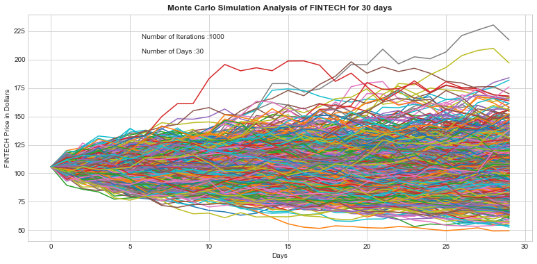

```python
import numpy as np
import pandas as pd
import seaborn as sns
import matplotlib.pyplot as plt
from pandas_datareader import data as wb
from __future__ import division
from pandas import Series,DataFrame
sns.set_style('whitegrid')
%matplotlib inline
```


```python
from datetime import datetime
```


```python
from datetime import datetime
bank_list = ['63MOONS.NS']
end = datetime.now()
start = datetime(end.year-12,end.month,end.day)
```


```python
for x in bank_list:
    globals()[x] = wb.DataReader(x,'yahoo',start,end)
```


```python
FINTECH = globals()[x]
```


```python
FINTECH.shape
```


    (2548, 6)


```python
FINTECH.head()
```


<div>
<style scoped>
    .dataframe tbody tr th:only-of-type {
        vertical-align: middle;
    }

    .dataframe tbody tr th {
        vertical-align: top;
    }

    .dataframe thead th {
        text-align: right;
    }
</style>
<table border="1" class="dataframe">
  <thead>
    <tr style="text-align: right;">
      <th></th>
      <th>High</th>
      <th>Low</th>
      <th>Open</th>
      <th>Close</th>
      <th>Volume</th>
      <th>Adj Close</th>
    </tr>
    <tr>
      <th>Date</th>
      <th></th>
      <th></th>
      <th></th>
      <th></th>
      <th></th>
      <th></th>
    </tr>
  </thead>
  <tbody>
    <tr>
      <th>2006-11-27</th>
      <td>2190.000000</td>
      <td>2050.000000</td>
      <td>2169.899902</td>
      <td>2160.399902</td>
      <td>61107.0</td>
      <td>2109.745605</td>
    </tr>
    <tr>
      <th>2006-11-28</th>
      <td>2235.000000</td>
      <td>2070.100098</td>
      <td>2140.000000</td>
      <td>2130.649902</td>
      <td>61051.0</td>
      <td>2080.693359</td>
    </tr>
    <tr>
      <th>2006-11-29</th>
      <td>2183.399902</td>
      <td>2026.500000</td>
      <td>2158.000000</td>
      <td>2049.600098</td>
      <td>35538.0</td>
      <td>2001.543823</td>
    </tr>
    <tr>
      <th>2006-11-30</th>
      <td>2116.000000</td>
      <td>2049.600098</td>
      <td>2078.000000</td>
      <td>2099.600098</td>
      <td>45290.0</td>
      <td>2050.371338</td>
    </tr>
    <tr>
      <th>2006-12-01</th>
      <td>2150.000000</td>
      <td>2060.000000</td>
      <td>2119.000000</td>
      <td>2066.250000</td>
      <td>24941.0</td>
      <td>2017.803345</td>
    </tr>
  </tbody>
</table>
</div>


```python
FINTECH['Adj Close'].plot(legend=True,figsize=(15,7))
plt.xlabel('Date')
plt.ylabel('Price in Rupees')
plt.title( 'Price of FINTECH')
```


    Text(0.5,1,'Price of FINTECH')


```python
S0_FINTECH = FINTECH['Adj Close'].iloc[-1]
S0_FINTECH # Start Price
```


    105.6500015258789


```python
log_returns_FINTECH = np.log( 1 + FINTECH['Adj Close'].pct_change()) 
log_returns_FINTECH.plot(legend=True,figsize=(12,5),linestyle='--',marker='o')
```


    <matplotlib.axes._subplots.AxesSubplot at 0x929350>


```python
from scipy.stats import norm
days = 30
iterations = 1000

u = log_returns_FINTECH.mean()
var = log_returns_FINTECH.var()
drift = u - (0.5*var)
stdev = log_returns_FINTECH.std()
type(drift), type(stdev)
drift, stdev
np.array(drift)
norm.ppf(0.95)

def monte_carlo_FINTECH(days,iterations,drift,stdev):

    daily_returns_FINTECH = np.exp(drift + stdev * norm.ppf(np.random.rand(days, iterations)))
    
    price_list = np.zeros_like(daily_returns_FINTECH)
    price_list[0] = S0_FINTECH

    for t in range(1, days):
        price_list[t] = price_list[t-1] * daily_returns_FINTECH[t]
    return price_list


plt.figure(figsize=(13,6))
#plt.plot(price_list)
plt.plot(monte_carlo_FINTECH(days,iterations,drift,stdev))
plt.xlabel('Days')
plt.ylabel('FINTECH Price in Dollars')
plt.figtext(0.3,0.8, s="Number of Iterations :%.0f" %iterations)
plt.figtext(0.3,0.75, s="Number of Days :%.0f" %days)
plt.title( u"Monte Carlo Simulation Analysis of FINTECH for %s days" % days, weight='bold')
```


    Text(0.5,1,'Monte Carlo Simulation Analysis of FINTECH for 30 days')





```python
S0_FINTECH
```


    105.6500015258789


```python
from sklearn.preprocessing import OneHotEncoder
runs = 10000
simulations_FINTECH = np.zeros(runs)
xrange=range
for run in xrange(runs):
    simulations_FINTECH = monte_carlo_FINTECH(days,iterations,drift,stdev)[days -1]
```


```python
q = np.percentile(simulations_FINTECH,1)

plt.figure(figsize=(7,5))

plt.hist(simulations_FINTECH,bins=100,color='lightblue')
plt.figtext(0.6,0.8, s="Start price: Rs %.2f" %S0_FINTECH)
plt.figtext(0.6,0.75, "Mean final price: Rs %.2f" %simulations_FINTECH.mean())
plt.figtext(0.6,0.7,"VaR(0.99): Rs %.2f" %(S0_FINTECH - q,))
plt.figtext(0.6,0.65,"q(0.99): Rs %.2f" %q)
plt.axvline(x=q, linewidth=4, color='red')
plt.title(u"Final price distribution for 63moons Share after %s days" % days, weight='bold');
```


